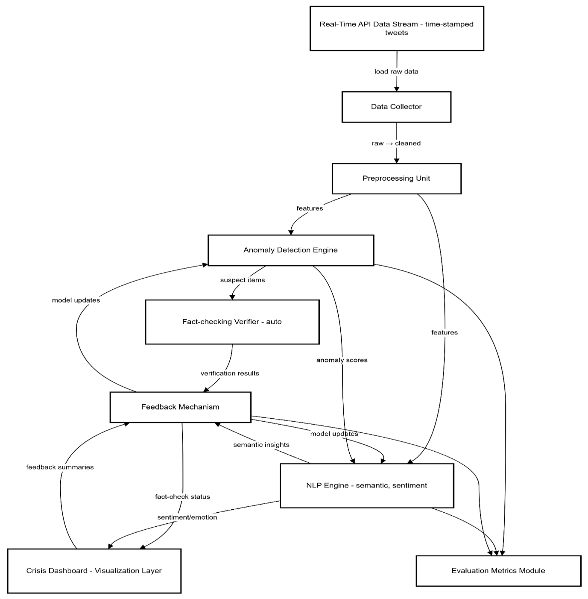

# Anomaly Detection in Social Media

A Python-based research framework for detecting anomalous crisis-related social media posts, enriching them with NLP features, and fact-checking suspicious content. The project combines classical machine learning, deep learning, transformer-based text representations, sentiment/emotion analysis, and a lightweight Mastodon ingestion API.



## Overview

This repository was developed as part of a data science thesis project focused on anomaly detection in social media data. The framework is designed to process crisis-related posts, identify unusual or potentially misleading content, and support downstream analysis through generated CSV outputs and a Power BI dashboard.

The workflow includes:

1. Data collection from CSV files or Mastodon public/search endpoints.
2. Text preprocessing and normalization.
3. Feature extraction using DTM, TF-IDF, and BERT embeddings.
4. Sentiment and emotion analysis.
5. Anomaly detection using several model families.
6. Fact-checking of suspected anomalous posts.
7. Export of results for evaluation and visualization.

## Key Features

* CSV-based data loading for prepared social media datasets.
* Mastodon API ingestion for public timeline and keyword search data.
* Text cleaning, tokenization, lemmatization, stop-word removal, and stemming.
* BERT embeddings using `bert-base-uncased`.
* TF-IDF and document-term matrix feature extraction.
* Sentiment analysis using `nlptown/bert-base-multilingual-uncased-sentiment`.
* Emotion detection using `j-hartmann/emotion-english-distilroberta-base`.
* Anomaly detection with:

  * K-Means
  * DBSCAN
  * Autoencoder
  * Hybrid Decision Tree / SVM / Naive Bayes approach
* Fact-checking pipeline using LM Studio and web-search evidence.
* Output files for anomaly scores, anomaly labels, fact-check results, merged results, and sentiment/emotion scores.
* Power BI dashboard file for visual analytics.

## Repository Structure

```text
Anomaly-Detection-in-Social-Media/
├── Modules/
│   ├── Anomaly_Detection.py
│   ├── Data_Collector.py
│   ├── Data_Preprocessor.py
│   ├── Fact_Checker.py
│   ├── Feedback.py
│   ├── Metrics_Evaluation.py
│   └── NLP_Engine.py
├── mastodon_crisis_api_project/
│   ├── app.py
│   ├── requirements.txt
│   ├── README.md
│   ├── runtime_data/
│   └── runtime_results/
├── combined_api_runs/
├── Anomaly_Detection.pbix
├── DataExploration.ipynb
├── Main.py
├── PipelineManager.py
├── Project_Diagram.png
├── framework_runner.py
└── operational_dataset_combo.py
```

## Main Components

### `PipelineManager.py`

Coordinates the full framework run. It loads data, preprocesses posts, creates feature representations, runs anomaly detection models, performs fact-checking on suspected posts, and saves output files.

### `Modules/Data_Preprocessor.py`

Handles text normalization and NLP feature creation, including tokenization, lemmatization, stemming, sentiment analysis, emotion detection, DTM, TF-IDF, and BERT embeddings.

### `Modules/Anomaly_Detection.py`

Contains anomaly detection methods based on K-Means, DBSCAN, autoencoders, and a hybrid classifier-based approach.

### `Modules/Fact_Checker.py`

Fact-checks suspicious social media claims using external search evidence and an LM Studio model. Results are written to `fact_check_results.csv`.

### `mastodon_crisis_api_project/app.py`

Provides a FastAPI service for collecting Mastodon posts, converting them into the framework's expected CSV schema, and triggering the full pipeline.

### `Anomaly_Detection.pbix`

Power BI dashboard for exploring anomaly detection and fact-checking results.

## Expected Input Schema

The pipeline expects a CSV dataset with columns similar to:

```text
Name
UserName
Timestamp
Verified
Tweets
Comments
Retweets
Likes
Impressions
Tags
Tweet Link
Tweet ID
Disaster
```

For the default script, `Main.py` expects a file named `DisasterTweets.csv` in the project root. You can also pass a different CSV path through `framework_runner.py` or the Mastodon API.

## Installation

Clone the repository:

```bash
git clone https://github.com/d-ioannidis/Anomaly-Detection-in-Social-Media.git
cd Anomaly-Detection-in-Social-Media
```

Create and activate a virtual environment:

```bash
python -m venv .venv
```

On Windows:

```bash
.venv\Scripts\activate
```

On macOS/Linux:

```bash
source .venv/bin/activate
```

Install the project dependencies:

```bash
pip install -r mastodon_crisis_api_project/requirements.txt
```

Install the spaCy English model:

```bash
python -m spacy download en_core_web_sm
```

The fact-checking module imports `lmstudio`, so install and configure LM Studio if you want to run the fact-checking stage:

```bash
pip install lmstudio
```

You may also need to download or configure the LM Studio model used in `Fact_Checker.py`:

```text
google/gemma-3-1b
```

## Running the Core Pipeline

Place your input CSV in the project root or update the path in `Main.py`:

```python
config = {
    "data_source": "DisasterTweets.csv",
    "output_dir": "runtime_results/manual_run"
}
```

Then run:

```bash
python Main.py
```

Alternatively, call the framework from another Python script:

```python
from framework_runner import run_framework

results = run_framework(
    csv_path="path/to/your_dataset.csv",
    output_dir="runtime_results/custom_run"
)
```

## Running the Mastodon API

The Mastodon API can collect public posts, normalize them into the framework schema, and run the pipeline.

Create an `.env` file inside `mastodon_crisis_api_project/`:

```text
MASTODON_BASE_URL=https://mastodon.social
MASTODON_ACCESS_TOKEN=
```

`MASTODON_ACCESS_TOKEN` can be left empty for public timeline use on many Mastodon instances, but some instances or search behavior may require a token.

Run the API from the repository root so it can import `PipelineManager.py`:

```bash
uvicorn mastodon_crisis_api_project.app:app --reload
```

The API will be available at:

```text
http://127.0.0.1:8000
```

### Useful API Endpoints

Health check:

```http
GET /health
```

Collect Mastodon public timeline posts:

```http
POST /collector/mastodon/timeline
```

Search Mastodon posts:

```http
POST /collector/mastodon/search
```

Convert raw Mastodon JSON into framework CSV format:

```http
POST /preprocess/mastodon-to-framework
```

Collect data and run the full pipeline:

```http
POST /pipeline/ingest-and-run
```

Preview latest generated results:

```http
GET /results/latest
```

Example full pipeline request:

```json
{
  "mode": "search",
  "query": "wildfire evacuation",
  "limit": 50,
  "resolve": true,
  "offset": 0,
  "min_keyword_matches": 1,
  "output_csv_name": "mastodon_wildfire_run.csv"
}
```

## Batch API Runs

`operational_dataset_combo.py` demonstrates how to run repeated API searches for crisis-related keywords, collect multiple outputs, merge them, and deduplicate posts by `Tweet ID`.

The default queries include wildfire-related search terms such as:

```python
QUERIES = ["wildfire", "forest fire", "brush fire", "evacuation order"]
```

## Generated Output Files

A pipeline run can generate files such as:

```text
anomaly_scores.csv
anomaly_results.csv
fact_check_results.csv
merged_data_results.csv
sentiment_emotion_scores.csv
```

Depending on how the pipeline is executed, these files are written to the configured output directory, such as `runtime_results/manual_run/` or the Mastodon API runtime folders.

## Analysis and Visualization

* `DataExploration.ipynb` contains exploratory analysis work.
* `Anomaly_Detection.pbix` contains the Power BI dashboard for visualizing results.
* `Project_Diagram.png` illustrates the high-level project workflow.

## Notes and Limitations

* This is a research prototype, not an official crisis-response or fact-checking system.
* Model outputs should be reviewed critically, especially in high-stakes crisis contexts.
* Fact-checking quality depends on available external evidence and the configured LM Studio model.
* BERT, sentiment, emotion, and autoencoder steps may require significant CPU/GPU resources.
* The Mastodon ingestion flow maps Mastodon reblogs to `Retweets` and sets `Impressions` to `0`, because impressions are not available in the simple ingestion flow.

## Future Improvements

Potential next steps include:

* Add a top-level `requirements.txt` for the full framework.
* Add tests for preprocessing, anomaly detection, and API endpoints.
* Improve configuration management for model names, thresholds, and output paths.
* Add Docker support for reproducible execution.
* Expand support for additional social media platforms or data sources.
* Add clearer evaluation examples using labeled datasets.
